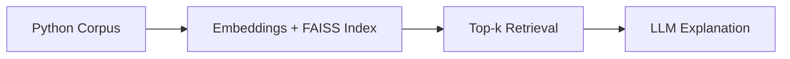

# LLM-Powered Code Assistant

**Interactive tool to query Python codebases and get LLM-powered explanations.**  
Built to demonstrate retrieval + reasoning pipelines for developer workflows.

---

## How It Works

## Quick Start
### Create and activate a virtual environment
python -m venv venv
source venv/bin/activate

### Install dependencies
pip install -r requirements.txt

### Run
python -m src.main

### Example query
Ask about the codebase: How does factorial work?

---

## Evaluation

19 hand-labeled questions over the 19-chunk demo corpus, measured on a single
local machine (see `eval/RESULTS.md` for the full report, commit, date, and
model versions). Reproduce with `python -m eval.run`.

| k | Recall@k | MRR@k |
|---|---|---|
| 1 | 0.89 | 0.89 |
| 3 | 1.00 | 0.95 |
| 5 | 1.00 | 0.95 |

| Stage | p50 | p95 |
|---|---|---|
| Retrieval | 32.6ms | 119.9ms |
| Generation (local Llama3 via Ollama) | 17.4s | 20.7s |

Retrieval and generation are reported separately because they're different
orders of magnitude — retrieval is fast (local FAISS search), generation is
the actual bottleneck (a full local LLM completion).
