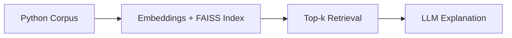

# LLM-Powered Code Assistant

**Interactive tool to query Python codebases and get LLM-powered explanations.**  
Built to demonstrate retrieval + reasoning pipelines for developer workflows.

---

## How It Works

## Quick Start
### Create and activate a virtual environment
python -m venv venv
source venv/bin/activate

### Install dependencies
pip install -r requirements.txt

### Run
python -m src.main

### Example query
Ask about the codebase: How does factorial work?
